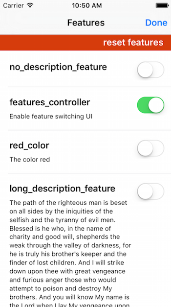

# FlipTheSwitch [](https://travis-ci.org/michaelengland/FlipTheSwitch) [](https://coveralls.io/r/michaelengland/FlipTheSwitch?branch=master)  

A feature switching/toggling/flipping library  for ObjectiveC.

# flip_the_switch [](https://travis-ci.org/michaelengland/FlipTheSwitch) [](https://codeclimate.com/github/michaelengland/FlipTheSwitch) [](https://codeclimate.com/github/michaelengland/FlipTheSwitch) [](http://badge.fury.io/rb/flip_the_switch)

A gem command line tool for generating the `Features.plist` & `FTSFlipTheSwitch+Features.{h,m}` categories to help with the corresponding Pod.

## The Problem

We have a a new feature we've been working on, `AmazingFeature`, and we've been building it inside a branch.
Now has come the time to finally merge it back in. This then takes us the next day, as the `MyApp.xcodeproj/project.pbxproj` file has a lot of conflicting changes, and we get things wrong a lot before we get them right.
We weren't able to rebase often, as multiple people were working on this branch, and so we also had to keep regularly merging in all of the other changes from the rest of the team, constantly losing focus of our goal.
We finally have it all merged and then... *everything breaks*!

The way to avoid all of these constant merges/rebases/context switches is to always have our code in the `master` branch, but we didn't want to affect the rest of the team while they released `QuickerFeature` in the next release cycle.

How can we get the benefits of working on `master` branch, while still not worrying about breaking the other features while we build `AmazingFeature`?

## Introducing FlipTheSwitch

### Auto-Generated Files:

With 'FTSFlipTheSwitch', we can choose different code paths at runtime:

```objective-c
self.newFeatureButton.hidden = [[FTSFlipTheSwitch sharedInstance] isFeatureEnabled:@"new_feature"];
```

The features can be enabled/disabled at runtime:

```objective-c
[[FTSFlipTheSwitch sharedInstance] enableFeature:@"new_feature"];
```

```objective-c
[[FTSFlipTheSwitch sharedInstance] disableFeature:@"new_feature"];
```

```objective-c
[[FTSFlipTheSwitch sharedInstance] setFeature:@"new_feature" enabled:YES];
```

All enabled features will persist between app loads through `NSUserDefaults`.

The features can defaulted to enabled/disabled via a plist file `Features.plist`:

```xml
<?xml version="1.0" encoding="UTF-8"?>
<!DOCTYPE plist PUBLIC "-//Apple Computer//DTD PLIST 1.0//EN" "http://www.apple.com/DTDs/PropertyList-1.0.dtd">
<plist version="1.0">
<dict>
	<key>disabled_feature</key>
	<dict>
		<key>description</key>
		<string>is disabled description</string>
		<key>enabled</key>
		<false/>
	</dict>
	<key>enabled_feature</key>
	<dict>
		<key>enabled</key>
		<true/>
	</dict>
</dict>
</plist>

```

### Subfeatures

You can add as many subfeatures to a feature recursively. Resulting in a plist as e.g. :

```xml
<?xml version="1.0" encoding="UTF-8"?>
<!DOCTYPE plist PUBLIC "-//Apple Computer//DTD PLIST 1.0//EN" "http://www.apple.com/DTDs/PropertyList-1.0.dtd">
<plist version="1.0">
	<dict>
		<key>description</key>
		<string>is disabled description</string>
		<key>enabled</key>
		<false/>
		<key>subfeature</key>
		<dict>
			<key>enabled</key>
			<true/>
		</dict>
	</dict>
</plist>
```

### Configuration Screen



* shows all features, their description texts and enabled state
* easily switching features on and off
* reset all feature back to the original setting from the plist (based on the json)

### Notifications

When a feature status changes, you can find out about it by listening for the notification titled `FTSFeatureStatusChangedNotification`, which contains:

* `FTSFeatureStatusChangedNotificationFeatureKey` - the key of the feature being enabled/disabled
* `FTSFeatureStatusChangedNotificationEnabledKey` - the `NSNumber` of whether the feature was enabled or disabled

### Plattform Support

* iOS 
	* example project
	* full test coverage
	* configuration screen
* Mac OSX 
	* example project
	* full test coverage

## Command-Line-Interface

If you install the gem, you will be able to use the Command-Line-Interface.

The CLI consists of 3 commands:

 - `plist` - creates a `Features.plist` file for enabled/disabled features including their description (optional) like that mentioned above.
 - `settings` - creates a `Settings.bundle` used by the OS settings. These can then be used to enable/disable the features at runtime.
 - `category` - creates `FTSFlipTheSwitch+Features.{h,m}` files for features, thus giving compile-time checks for adding/removal of new features.
e.g:

```objective-c
/* AUTO-GENERATED. DO NOT ALTER */
#import <FlipTheSwitch/FTSFlipTheSwitch.h>

@interface FTSFlipTheSwitch (Features)

+ (BOOL)isAwesomeFeatureEnabled;
+ (void)enableAwesomeFeature;
+ (void)disableAwesomeFeature;
+ (void)setAwesomeFeatureEnabled:(BOOL)enabled;
+ (void)resetAwesomeFeatureController;
+ (NSString *)awesomeFeatureControllerKey;

@end
```

### Define Features and subfeatures

The features and subfeatures, along with their default enabled/disabled state, are read from a `features.json` file. e.g.:

```json
{
	"default": {
		"awesome_feature": {
			"enabled": true,	
			"description": "Makes this project awesome",
			"sub_feature": {
				"enabled": true,
				"description": "Makes this project even more awesome"		
			}
		}
	},
	"beta": {
		"awesome_feature": {
			"enabled": false
		}
	}
}    
    
```

In order to avoid typing in the same options all the time, you can create a `.flip.yml` file for the default options, e.g.:

```yaml
input: features
environment: development
category_output: Classes/Extensions
```

For more information, run `flip-the-switch help`

## How to install

Add `pod 'FlipTheSwitch'` to your Podfile

Add `gem 'flip_the_switch'` to your Gemfile

## Authors

  - [Michael England](https://github.com/michaelengland) @ [SoundCloud](https://github.com/soundcloud)
  - [Rob Siwek](https://github.com/nerdsRob) @ [SoundCloud](https://github.com/soundcloud)
  - [Kristina Roddewig](https://github.com/FrauR) @ [SoundCloud](https://github.com/soundcloud)
  - [Vincent Garrigues](https://github.com/garriguv) @ [SoundCloud](https://github.com/soundcloud)

## License

FlipTheSwitch is available under the MIT license. See the LICENSE file for more info.
